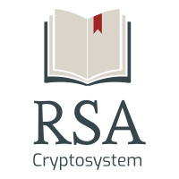

<p align = "center">
 <br>
<a href="#steps">Steps</a> • <a href="#explanation">Explanation</a> • <a href="#viability">Viability</a> • <a href="#practical-implementation">Practical Implementation</a> • <a href="#lockencryption">Encryption</a> • <a href="#unlockdecryption">Decryption</a>  
</p>

---
Steps
---

- First select two distinct prime numbers, say p and q. (random primes, preferably big to score a decent level of security)

> Can be generated using a primality test. <br>
> Fermat’s test can be used, although practically Miller Rabin’s test is more sought after.

- Take the product i.e. n=p*q, which is the *modulus* of both the keys.

- Then calculate the Euler’s totient, given by ϕ(n) = (p-1)*(q-1). 

- Proceed by choosing public key e such that e>2 and coprime to totient i.e., gcd(e,totient) must be equal to 1.

- Choose a corresponding private key d such that it satisfies the equation or e*d mod ϕ(n)=1. 

> d is the multiplicative inverse of e modϕ(n). <br>
> Public key comprises of (e,n) and private key comprises of (d). <br>
> As e is much smaller than d, encrypting a message using RSA is much faster than decrypting it. 

- Ciphertext is calculated using the equation c=m<sup>e</sup>modn where m is the message to be encrypted.

- With the help of c and d thus obtained, we can decrypt the message using m=c<sup>d</sup>modn.

Explanation
-------

The Euler’s totient φ(n) of a positive integer n greater than 1 is defined to be the number of positive integers less than n that are coprime (only positive divisor is 1 or gcd is 1 between two numbers) to n. (φ(1) is defined to be 1)
when n is prime, ϕ (n)=n-1, as in the case of Fermat’s theorem.
Plaintext and ciphertext are integers between 0 and n-1 for some n.

Encryption and decryption are of the following form, for some plaintext M and ciphertext C:
C = M<sup>e</sup>(mod n) 
M = C<sup>d</sup>(mod n) = (M<sup>e</sup>)<sup>d</sup>(mod n) = M<sup>ed</sup>(mod n)

Each communicating entity has one public key (e,n) or private key (d,n) pair, where e and d are each the multiplicative inverse (modϕ(n)) of the other. 

=> e and d are inverses (modϕ(n)), or ed ≡ 1 (modϕ(n))

=> ed = 1 + kϕ(n), for some k.

=> M<sup>ed</sup>(mod n) =M<sup>1 + kϕ(n)</sup>(mod n) = M<sup>1</sup> x (M <sup>ϕ(n)</sup>)<sup>k</sup>(mod ϕ(n)) = M<sup>1</sup> x 1<sup>k</sup>(mod n) = M. (Euler’s theorem)

Therefore, to decrypt a ciphertext C = M<sup>ed</sup>(mod n), we only need to calculate C<sup>d</sup>(mod n) because we know C= M<sup>e</sup>(mod n) => C<sup>d</sup>(mod n)= M<sup>ed</sup>(mod n) => C<sup>d</sup>(mod n)=M. (since M<sup>ed</sup>(mod n) = M)

Viability
-------

The RSA cryptosystem is based on the theorem which implies that the inverse of the function a->a<sup>e</sup>modn (where e is the public encryption exponent) is the function b->b<sup>d</sup>modn, (where d is the private decryption exponent) which gives the difficulty of computing ϕ(n) without knowing the factorization of n, thus the difficulty of computing d arises too. 
This can only be solved by factorizing n (since every number is essentially a product of primes) and only the owner of the private key knows the factorization (primes p,q whose product yields n). This ‘factoring problem’ is the security point, with more chances of the encryption to be secure for large values of n, or for large primes considered. Only n being publicly disclosed, along with the given difficulty to factor large numbers (it is computationally infeasible to factor a large value of n to get d) gives the guarantee that no one else knows the factorization and the encrypted message, thus making it viable.

Practical Implementation
-------

The written code works well for small primes but considering a deeper level of security, preferable prime length for the 2 primes considered (p,q) ranges to around primes of 2048 bits which result in values (n) greater than 4096 bits upon their multiplication (p*q). This ensures a tight encryption which is seemingly impossible to decrypt (although completely possible to breach every combination if we were to leverage the power of supercomputers) with massive computing resources even with a large span of time allotted.

Hence RSA is quite feasible in general, apart from its downsides like being much slower than symmetric cryptosystems. <br>
There are better alternatives and encryption schemes such as elliptic curve cryptography, but then again - Quantum computing could overcome that as well. Eventually nothing seems that secure, or has a counter-measure in the long run.

-------
Summary addon for encryption/decryption: (22/06/19)

:lock:Encryption
-------
Input: RSA public key (n,e), plaintext m ∈ [0,n-1] |
Output: Ciphertext c, (Compute c = m<sup>e</sup>(mod n), return c).

:unlock:Decryption
-------
Input: RSA public key (n,e), RSA private key d, ciphertext c |
Output: Plaintext m,  (Compute m = c<sup>d</sup>(mod n), return m). 

-------
Setting up SSH using RSA keys for Github: (03/08/19) <br>

For SSH authentication, it is rather typical that the users provision the key pair for themselves. Using the SSH protocol, one can connect and authenticate to remote servers and services. With SSH keys, one can connect to GitHub without supplying username or password at each visit. For setting up SSH locally within your system using RSA keys, follow along:

First check if files '(/.ssh/)id_rsa' and '(/.ssh/)id_rsa.pub' exist in your system.
If not, one can create such public/private keys by opening a terminal and typing:
```
$ ssh-keygen -t rsa -C "your_email@example.com"
```
Next we require to copy our public key (the contents of freshly created 'id_rsa.pub') into our clipboard. To follow on a Mac, in the terminal/shell, type:
```
$ pbcopy < ~/.ssh/id_rsa.pub
```
Paste the obtained SSH public key into your github account settings. <br>
Then from settings click “SSH Keys” on the left and then click “Add SSH Key” on the right. Add a label (like “My System”) and paste the public key into the text box. In a terminal/shell, type the following to test it:
```
$ ssh -T git@github.com
```
If 'You've successfully authenticated' is included in the follow-up message, you're good to go!
